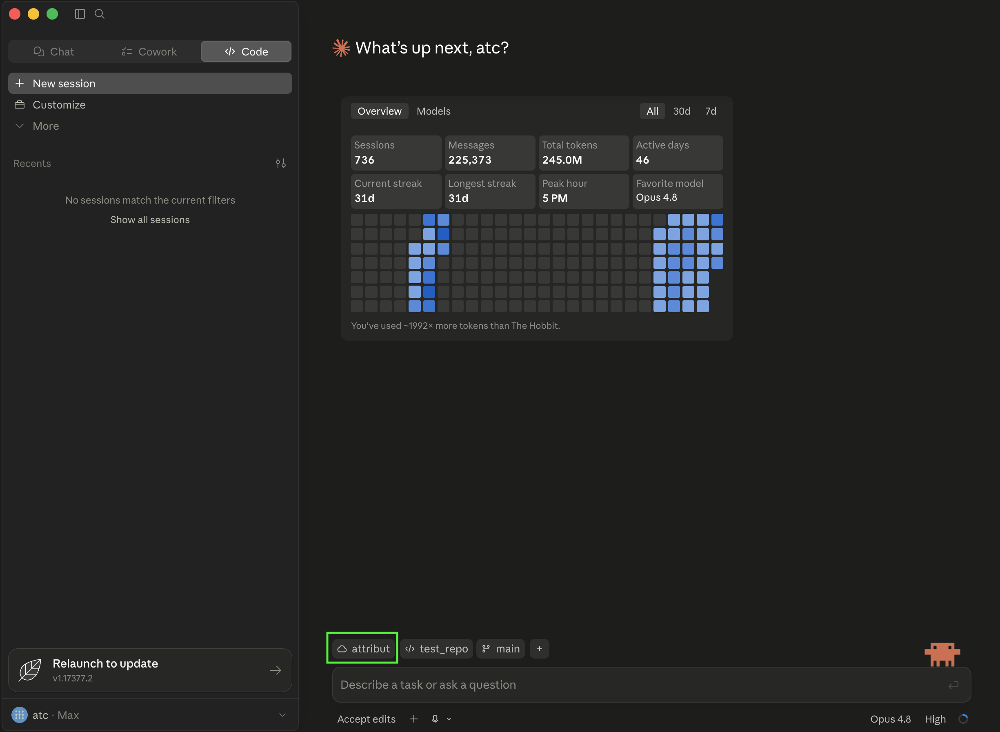
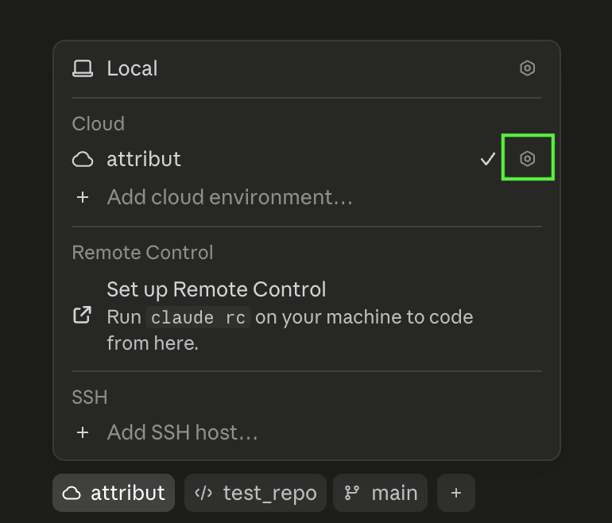
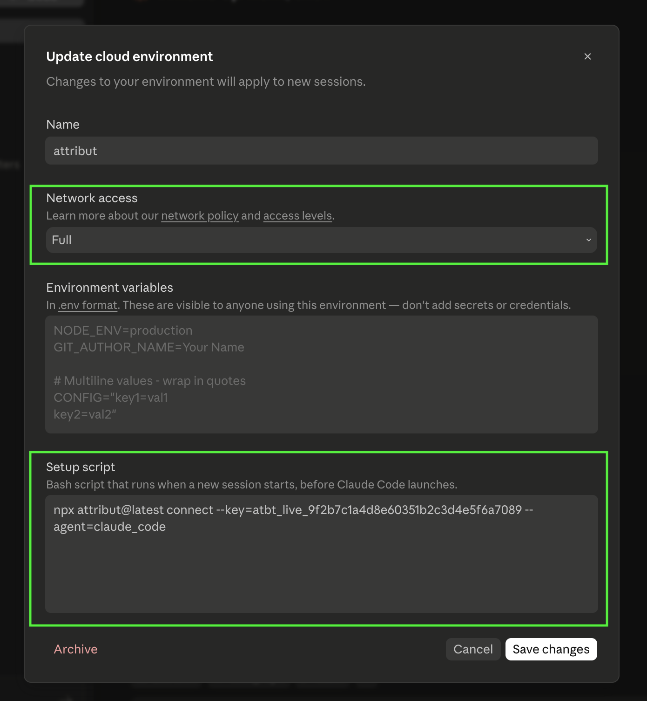

# Connect Claude Code cloud environments to ATTRIBUT

Claude Code sessions that run on the web (claude.ai/code) have no interactive terminal at startup, so they can't use the normal browser sign-in. Instead you pair them once with a **setup script** on the cloud environment — every session that runs there is then captured automatically.

## Before you start

- A Claude Code **cloud environment** (Claude Code on the web).
- An **ingest token** for `claude_code`. Copy it from the **App · Cloud** card in the ATTRIBUT web app.

## 1. Open your cloud environment settings

In Claude Code, open the environment selector and click the **gear icon** next to your cloud environment (or **Add cloud environment** to make a new one).



## 2. Set network access and the setup script

In the **Update cloud environment** dialog:

1. Set **Network access** to **Full**. This is required — the setup script installs from npm and the capture hook sends telemetry to `ingest.attribut.ai`; a restricted network blocks both.
2. Paste this into the **Setup script** box:

```sh
npx attribut@latest connect --key=<your-ingest-token> --agent=claude_code
```

3. Click **Save changes**.



Leave the token out of **Environment variables** — that field is visible to anyone who can use the environment. The setup-script line is the right place for the one-time pairing command.

## 3. Start a session

The setup script runs once, before Claude Code launches, and the result is cached — so the capture hook is already live for that session and every later one. Pick the cloud environment and start working.



Cloud sessions are linked automatically: Claude Code sets `CLAUDE_CODE_REMOTE_SESSION_ID` in the sandbox, and ATTRIBUT stamps it so each run reconciles with its pull request.

## Notes

- `--key` and `--token` are the same flag; the token is scoped to `claude_code`.
- The token is a write-only ingest token, not a broad credential — but treat it with care and rotate it if it leaks.
- Nothing to restart: because the setup script runs before Claude Code starts, capture is active from the first session.

## Related

- Connect your AI tools to ATTRIBUT
- What ATTRIBUT captures — and what it never sends
- Troubleshooting & configuration
